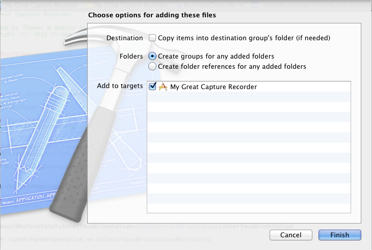
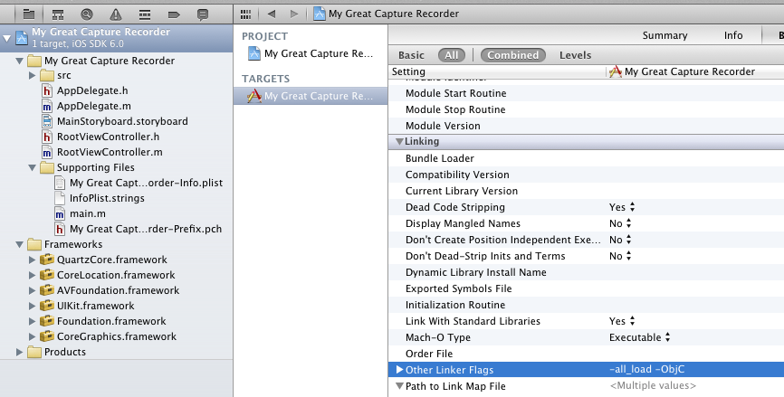

Getting the SDK
===============

Downloading and installing the SDK is a piece of cake. The steps outlined below will show you how to easily download and include the proper files to work with the Strabo capture code used in the Toast and Ramble products.

Cloning the Git Repo
--------------------

The code that you will need is hosted on [GitHub](http://github.com). Request access by emailing Nate at: nate@strabogis.com. If you already have access to the repository, you can browse it [online](https://github.com/StraboLLC/Strabo-Multi-Recorder). Otherwise, clone the repository:

1. Install [Git](http://git-scm.com/)
2. Clone the repository

Run the following code in terminal:

	$ cd ~/new/directory/strabo-multi-recorder
	$ git clone https://github.com/StraboLLC/Strabo-Multi-Recorder

The contents of this repo should be as follows:

	/Multi-Recorder/
		sample/
			My Great Capture Recorder/
				-sample xcode project files
		scripts/
			buildSDK
			installDocs
		src/
			libStrabo-Multi-Recorder.a

Installing the Documentation
----------------------------

The complete documentation for the project comes packaged with the SDK. To install the docs to the Xcode library, open a new terminal window and run the installDocs script.

	$ cd ...Multi-Recorder/scripts
	$ ./installDocs

Integrating With a Project
--------------------------

You should already have created your Xcode iOS application project. If not, do so now. Complete the following steps to add the library to your current project.

###Add The Files

The "src" folder contains everything that you need. Find the folder in your cloned repo and drag it into your project. The following prompt will appear:

You can choose whether or not to select the dialog box to copy the files into your project. If you choose to leave it deselected, you can pull the most recent changes from the remote git repository and your files will automatically be kept in sync with the most recent bugfixes, etc. Otherwise, you will need to re-copy the src folder anytime you wish to update to the most recent build.

###Fix Xcode Linking

There is a [known Xcode bug](https://developer.apple.com/library/mac/#qa/qa2006/qa1490.html) which causes an object category linking error. Because this application extends some subclasses of NSObject in the SDK, you will need a quick hack to force those object categories to be linked.

1. In Xcode, click the target's name under "Targets" in the Project window.
2. Choose the Build pane from the ensuing Info window.
3. Scroll down to the Other Linker Flags build setting under the Linking collection and set its value to -ObjC.
4. Add another value to the Other Linker Flags build setting and set its value to -all_load.

When performing these steps, be sure that you add these tags to all builds (both debug, release, and any others that you may create). This can be easily done by changing the tag values on the top level instead of setting the tags for each build individually.

###Including Necessary Frameworks

This SDK uses a couple of Apple iOS frameworks which you must include in your project. Be sure to add the following:

* CoreMedia
* QuartzCore
* CoreLocation
* AVFoundation
* UIKit
* Foundation
* CoreGraphics

*** STUB ***

###Have a Beer

Congratulations! You should have successfully added the Strabo MultiRecorder SDK to your project. You are ready to start building with Strabo. Check out the [guide](WorkingWithTheSDK) for more information about how to present the capture view controller and browse and upload captures. Treat yourself to a beer and then get to work coding up the rest of your app.