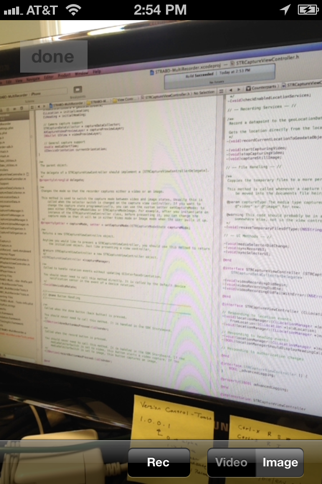

Working With the SDK
====================

If you have not downloaded the SDK yet, see "[Getting the SDK](GettingTheSDK)".

If you have downloaded and implemented the SDK, at some point in your application you will undoubtedly want to display the view to capture a video or image using the Strabo capture geo-tagging technique. This guide will walk you through the steps to present the capture view, dismiss the capture view, and then access the files that may have been captured.

Contents of this guide:

1. [Presenting the Capture View Controller](#section1)
2. [Accessing Local Captures](#section2)
3. [Uploading a Capture](#section3)

Presenting the Capture View Controller
---

The custom capture view controller is similar in appearance to Apple's native capture application. You present the capture view, an instance of a [STRCaptureViewController](STRCaptureViewController), modally and then dismiss it when the user is done taking pictures or video.

As of August 22, 2012, the STRCaptureViewController with all stock UI elements looks similar to the image on the right.

	

Prepare the view controller that will present the STRCaptureViewController as follows:

In your header file, import the sdk header file. This will ensure that you have access to all of the classes that you might decide to implement.

	#import "multi-recorder-sdk.h"

Alternatively, if you are a pro, you could just include the files that you know you will need:
	
	#import "StraboCaptureViewController.h"

Your view controller should also serve as a [STRCaptureViewControllerDelegate](STRCaptureViewControllerDelegate). That means that it needs to implement at least the required delegate methods. See the documentation for STRCaptureViewControllerDelegate for more details.

In many examples, the capture view will need to be presented when the user taps a button. For this reason, in my example, I will include the code to display the capture view as if it is hooked up to a button in a Storyboard file.

In total, your .h file might look similar to the following:

	//
	// FirstViewController.h
	// Created by Nate Beatty
	// Copyright (c) 2012 Strabo, LLC

	#import <UIKit/UIKit.h>
	#import "multi-recorder-sdk.h"

	@interface FirstViewController : UIViewController < STRCaptureViewControllerDelegate > {

	}

	// Button handling (buttons from storyboard)

	-(IBAction)cameraButtonWasPressed;

	// STRCaptureViewControllerDelegate methods

	-(void)parentShouldDismissCaptureViewController:(UIViewController *)sender;

	@end

In your .m file, you should include the code to initialize a new STRCaptureViewController and present it modally when necessary. In this case, we will put this code in the method that is called when the camera button is pressed. The method cameraButtonWasPressed should look like this:

	-(IBAction)cameraButtonWasPressed {
		// Create a new instance of a STRCaptureViewController
		STRCaptureViewController * captureVC = [STRCaptureViewController captureManager];
		// Assign the delegate to be self
		captureVC.delegate = self;
		// Present modally
		[self presentViewController:captureVC animated:YES completion:nil];
	}

As discussed above, we will need a complete implementation of the delegate method, [parentShouldDismissCaptureViewController:](STRCaptureViewControllerDelegate parentShouldDismissCaptureViewController:). This method should look something like this:

	-(void)parentShouldDismissCaptureViewController:(UIViewController *)sender {
    	[sender dismissViewControllerAnimated:YES completion:nil];
	}

Accessing Local Captures
---

Local captures are accessed using a [STRCaptureFileManger](STRCaptureFileManager). Alternatively, you could access the local file directory directory and use a NSFileManager or similar to access the StraboCapture file system, but this is highly discouraged.

The STRCaptureFileManager class provides a number of different methods for retreiving lists of local capture objects and is the best way to access the local captures. The most common methods will be discussed here; for a more detailed listing of all possible methods, please see the class [documentation](STRCaptureFileManager).

For gallery views and table views that show local captures to the user, you will most likely want to use the allCapturesSorted: method. This method returns an array of all of the local captures, sorted by date and with the most recent at array index 0 if `sorted == YES`. 

For example, you could make a table view with custom UITableViewCell cells, each of which displays a thumbnail, a title, and a capture date.

When the view loads, maybe in `-(void)viewDidLoad;`, you could set an instance variable to be an array of captures:

	STRCaptureFileManager * captureFileManager = [STRCaptureFileManager defaultManager];
	_captureArray = [captureFileManager allCapturesSorted:YES];

In the standard protocol method [UITableView tableView:cellForRowAtIndexPath:], you could implement some code similar to the following. It is assumed that you have created a custom subclass of UITableViewCell in the example below.

	- (UITableViewCell *)tableView:(UITableView *)tableView cellForRowAtIndexPath:(NSIndexPath *)indexPath
	{
	    static NSString *CellIdentifier = @"customCell";
	    MyCustomCell *cell = (MyCustomCell *)[tableView dequeueReusableCellWithIdentifier:CellIdentifier];

	    /******************************************************************************************
	    *
	    *	For the purposes of this example, assume that MyCustomCell has the following properties:
	   	*		- (UILabel *) titleLabel
	   	*		- (UILabel *) dateLabel
	   	*		- (UIImageView *) thumbnailImageView
	   	*
	   	*******************************************************************************************/
	    
	    // Configure the cell...
	    // Get the index of the cell - corresponds to the index of the capture in the capture array
	    NSNumber * index = @([indexPath indexAtPosition:1]);
	    // Get a handle on the cell
	    STRCapture * capture = [_captureArray objectAtIndex:index];
	    // Set the title
	    cell.titleLabel.text = capture.title;
	    // Set an image 
	    cell.thumbnailImageView.image = capture.image;
	    // Set the date
	    cell.dateLabel.text = capture.creationDate.description;
	    
	    return cell;
	}

Uploading a Capture
---

This SDK provides an object to help you upload captures to the Strabo server for later playback and handling on the web. Strabo will handle the storage of the video and you are responsible for keeping track of how videos are associated with users, etc. The following section of the guide walks you through how to use a [STRCaptureFileManager](STRCaptureFileManager) to handle an upload and how to keep track of uploaded videos for later integration with the [web api](http://api.strabo.co/).

To upload a capture, you will need to do the following:

1. [Create a STRCapture Object](#section3.1)
2. [Instantiate a STRCaptureUploadManager](#section3.2)
3. [Upload the Capture Object](#section3.3)
4. [Handle the Upload Appropriately](#section3.4)

###Create a STRCapture Object

If you wish to upload a capture to the Strabo server, you will first need to create a STRCapture object for the relevant capture. Most practically, this should be done with a [STRCaptureFileManager](STRCaptureFileManager) object, as described in [Accessing Local Captures](#section2). This is the recommended method. 

Alternatively, if you are programming at a lower level of abstraction and know the subdirectory path of the capture within the capture file system, you can instantiate a STRCapture object directly by using the [captureFromFilesAtDirectory:]([STRCapture captureFromFilesAtDirectory:]) class method. This is not recommended, particularly if you do not have access to the source files and are familiar with the file storage system and structures.

###Instantiate a STRCaptureUploadManager

Instead of sending a POST request to a server yourself, you can use the [STRCaptureUploadManager](STRCaptureFileManager) class to do the work for you. Create a new STRCaptureUploadManager by using the [defaultManager]([STRCaptureUploadManager defaultManager]) class method.

###Upload the Capture Object

Next, you can pass your previously created STRCapture object to the manager using the [STRCaptureUploadManager beginUploadForCapture:] method. This will start an asynchronous upload to the Strabo servers and will store your capture in the cloud.

Your code will look something like the following:
	
	// Create the capture object
	STRCapture * capture = // Create capture object using a STRCaptureFileManager

	// Upload the capture
	STRCaptureUploadManager * uploadManager = [STRCaptureUploadManager defaultManager];
	[uploadManager beginUploadForCapture:capture];

If at any point you need to cancel the upload, call the [cancelCurrentUpload]([STRCaptureUploadManager cancelCurrentUpload]) method.

To monitor the upload, you should implement the [STRCaptureUploadManagerDelegate](STRCaptureUploadManagerDelegate). Although all of the methods in this protocol are optional, they will be useful to determine the progress and status of the upload. Implementing the protocol is fairly straightforward - see the protocol documentation for more information.

###Handle the Upload Appropriately

Because the captures are uploaded to the Strabo servers, you will need to get a reference to the uploaded capture in order to access it via the web API. The [STRCaptureUploadManagerDelegate](STRCaptureUploadManagerDelegate) provides a means for you to easily obtain the unique token for a capture upon successful upload. You will need to figure out a way to save this token for later use with the web API. One possible solution is outlined below:

####Save the token

Save the token locally. It may be helpful to keep a list of tokens that the user has previously uploaded on the device. It may also be helpful to associate some meta data with the token when you save it. For example, you could store all tokens in a table in a database or file with the following fields:

<table>
	<tr style="font-weight: bold;">
		<td>token</td>
		<td>userID</td>
		<td>uploadDate</td>
		<td>capturedDate</td>
		<td>taggedSpecies</td>
		<td>hasBeenUploaded</td>
	</tr>
	<tr>
		<td>338d2c23d2308bfced...</td>
		<td>00500001</td>
		<td>1344352275.333697</td>
		<td>1344352260</td>
		<td>
<pre>
[ 
	aspen, 
	dogwood,
	cherry,
	sequoia
]
</pre>
		</td>
		<td>
			YES
		</td>
	</tr>
</table>

####Upload tokens and associated data

Upload the token and any associated data to your server. When the device has access to the internet, you could sync the local table as described above to a table that you keep on your cloud server.

####Access tokens and retrieve captures

Using the data stored on the cloud in your table of users, tokens, and associated data, you can search for tokens by any parameters you would like. For the example I have described above, you could, in theory, search for all captures tagged with "Sequoia" and generate an array of corresponding tokens. The web API describes how to access captures using the unique token identifier strings. Once you obtain this array of tokens from your own database, you can pass it to the javascript library to retrieve a series of captures.